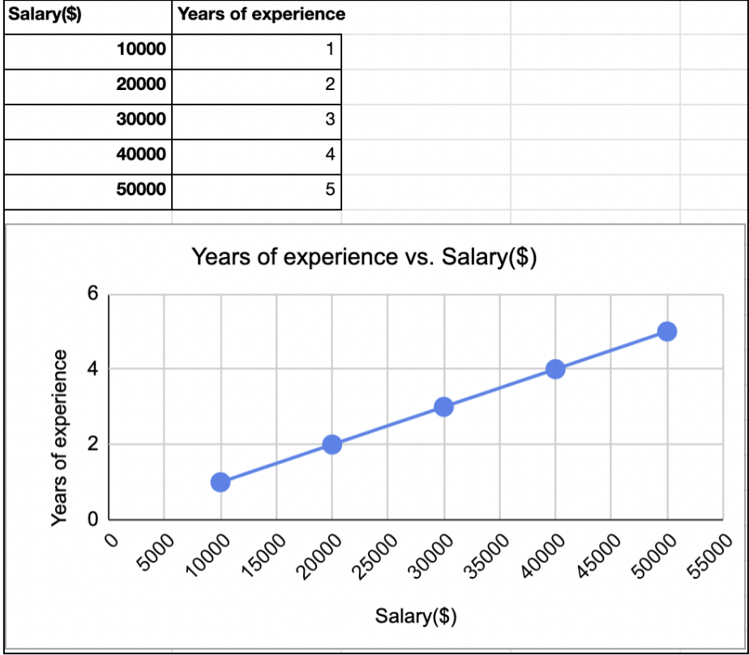

# Final-demo_Linear_Regression

For two weeks we have been reviewing the math behind Linear Regression and trying to understand how to implement using Python and what not. We have gone through enough technical details in our coursework too using various datasets. But I am sure we all are curious to understand where this is actually being used in the real world or what its significance is. We all know that this is a very important concept, so let me walk you through some very interesting applications of Linear regression. Did you know medical researchers often use linear regression to understand the relationship between drug dosage and blood pressure of patients. They administer various dosages of a certain drug to patients and observe how their blood pressure responds using this simple linear regression equation. 

**blood pressure = β0 + β1(dosage)** 

Here the response variable is the BP levels and the predictor variable is drug dosage. How cool is this, math being used in medical research !

Next we have data scientists using linear regression to measure the effect that different training regimens might have on player performance. They analyze how different amounts of weekly yoga sessions and weightlifting sessions affect the number of points a player scores using this multiple linear regression equation.

**points scored = β0 + β1(yoga sessions) + β2(weightlifting sessions)** 

Here the response variable is the performance of the player(points scored) and the predictor variables are number of yoga sessions and weightlifting sessions.

Looking at these examples we thought of using linear regression to answer a very age old question which we get a lot from our relatives (especially grandparents): When are we getting married? We thought why not explain this using the linear regression model which can predict the age of getting married.
To explain our grandma the concept of linear regression, we would begin by showing her the below figure:

This is a good example to make anyone understand the linear regression concept as everyone knows that salary generally depends on the years of experience.

**salary = β0 + β1(years of experience)**

Here salary is the response variable and years of experience is the predictor variable.

Now that grandma got a hang of basic linear regression we will walk her through Multiple Linear Regression and how it relates to the topic she cares a lot about, our marriage time.

Multiple Linear Regression is a statistical technique that uses several explanatory variables (predictors) to predict the outcome of the response variable.

Using this concept we can say that marriage age (response variable) relates to many factors (predictors), such as regions, education level, salary, parents and friends’ marriage age, and even COVID. So we can build up this MLR model like this:

**Marriage_age = β0 + β1(education_level) + β2(salary) + β3(race) + β4(parents_marriage_age) + β5(COVID) + β6(region) + β7(friends_marriage_age)**

Grandma, now we hope that you have a better understanding of Linear Regression, and feel more comfortable to understand that being single our age is cool, and it’s out of our control because it’s influenced by so many factors. Let’s hope Grandma won’t bug us with this question again. HAHA!

